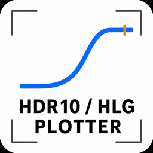
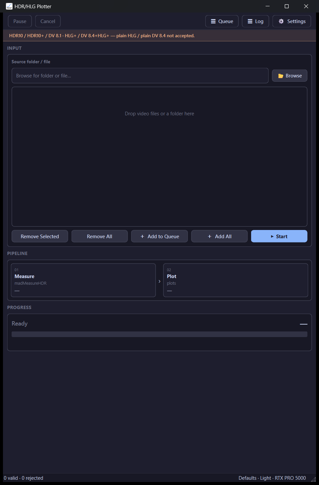
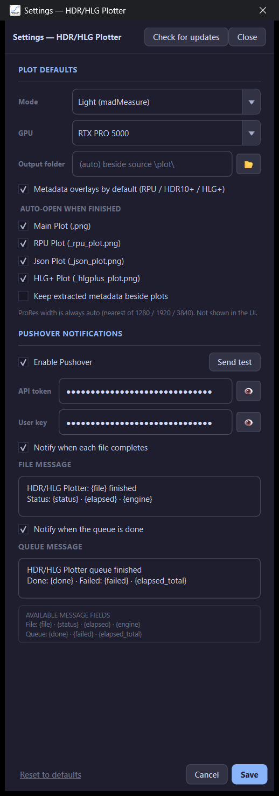

# HDR/HLG Plotter

  

  
  
  
  

---

## What is HDR/HLG Plotter?

**HDR/HLG Plotter draws brightness / metadata charts for HDR videos** so you can *see* how bright a title is over time — MaxCLL-style peaks, dynamic metadata, HLG+ curves, Dolby Vision RPU overlays, and more.

Think of it as a **report card for HDR**: drop an MKV in, click **Start**, get PNG plots next to the file (default `\plot\` folder). Optional: auto-open the plots when done, and Pushover when the queue finishes.

### Accepted inputs

| Accepted | Not accepted |
|----------|----------------|
| HDR10, HDR10+, DV 8.1 | Plain HLG |
| HLG+, DV 8.4 + HLG+ | Plain DV 8.4 |

### What happens to each file

| Step | In plain words |
|------|----------------|
| **1 · Measure** *(when needed)* | Light mode uses **madMeasureHDR**; Full can go through a ProRes measure path. HLG+ family often skips straight to metadata plots. |
| **2 · Plot** | Build PNG charts (main PQ plot, optional RPU / HDR10+ JSON / HLG+ overlays). |

Defaults: **Light (madMeasure)**, overlays on, plots beside the source.

---

## Screenshots

  

<em>Main window — drop HDR MKVs, Measure → Plot.</em>

  

<em>Settings — Light/Full mode, GPU, auto-open plots, Pushover.</em>

---

## How to use (quick start)

1. Install from [Releases](https://github.com/aberthil/HDRHLGPlotter-releases/releases/latest) and open **HDR/HLG Plotter**.  
2. **Browse** or **drag-and-drop** accepted HDR MKVs / a folder.  
3. Optional: **Settings** → Light vs Full, which plot PNGs to auto-open.  
4. **+ Add to Queue** → **Start**.  
5. Open the `\plot\` folder beside your source (or whatever destination you set).

---

## Download

| | |
|--|--|
| **Latest Setup** | [HDRHLGPlotter-1.0.0-Setup.exe](https://github.com/aberthil/HDRHLGPlotter-releases/releases/latest/download/HDRHLGPlotter-1.0.0-Setup.exe) |
| **All versions** | [Releases](https://github.com/aberthil/HDRHLGPlotter-releases/releases) |
| **SHA-256** | [HDRHLGPlotter-1.0.0-Setup.exe.sha256](https://github.com/aberthil/HDRHLGPlotter-releases/releases/latest/download/HDRHLGPlotter-1.0.0-Setup.exe.sha256) |

> Prefer the **latest** tag always:  
> https://github.com/aberthil/HDRHLGPlotter-releases/releases/latest

Installs to `C:\DolbyVisionScripts\HDRHLGPlotter` by default. Settings / Pushover / queue live in AppData and **survive App Update**.

---

## Requirements

| | |
|--|--|
| OS | Windows 10/11 **x64** |
| GPU | NVIDIA recommended (madMeasure / measure paths) |
| Input | MKV with supported HDR / HLG+ / DV flavors (see table above) |

---

## What's New

### v1.0.0

First standalone public Setup. See [Releases](https://github.com/aberthil/HDRHLGPlotter-releases/releases) for notes.

---

## Links

- **Latest download:** https://github.com/aberthil/HDRHLGPlotter-releases/releases/latest  
- **This repo:** public Setup hosting + project page (source stays private)

---

## License / support

Windows installers for end users. Problems with a specific Setup: note the release tag and contact the publisher (`aberthil`).
